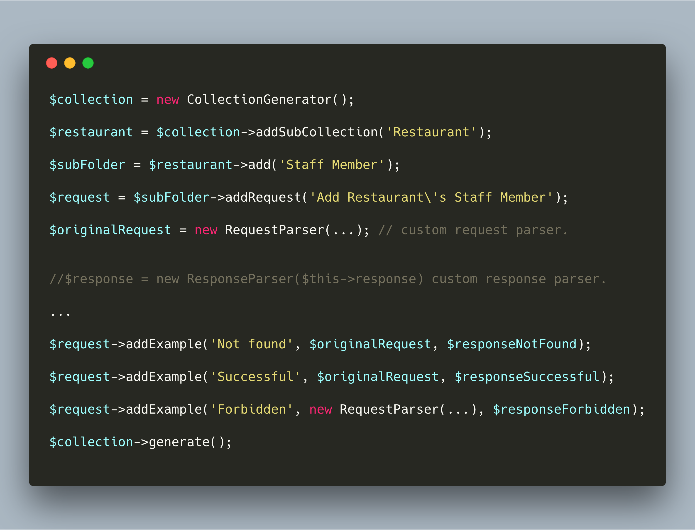

## About

Postman collection generator is a simple package for exporting collection .json file format.
Best used to be integrated in your functional testing.

## Postman Schema version
Package currently supports https://schema.getpostman.com/json/collection/v2.0.0/docs/index.html

## master - v1.0
- Be able to modify existing collection.

## Road Map
- Be able to detect version semantic changes.
- Be able to sync collection into existing file.
- Be able to generate mock server by reusing existing collection data.
- Be able to add supported files for Collection > Requests > Examples
 - Description in mark down file format (.md)
 - Configuration for requests and examples
    - Query Parameters rule
    - Be able to include query parameter details in tabular form for example:
    
    | Parameter | Type | Description | Required |
      |:----------|:-----|:------------|:---------|
      |first_name |string|First name	 |Yes|
      |last_name|string|Last name		 |Yes|
      |mobile|string|Mobile number	 |Yes|
      |email 		|string|Email		 |Yes|
   - This configuration will be linked to the application instance must be consistent to the application layer routes.
   
 - Add an adapter for Lumen / Laravel Support.
    - Service Provider
    - TestCase

## Usage

