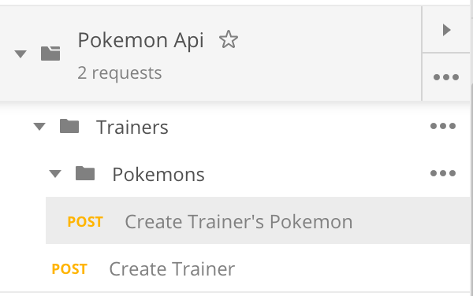
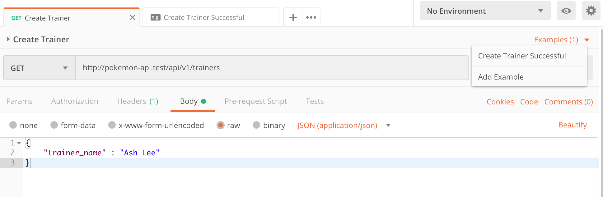
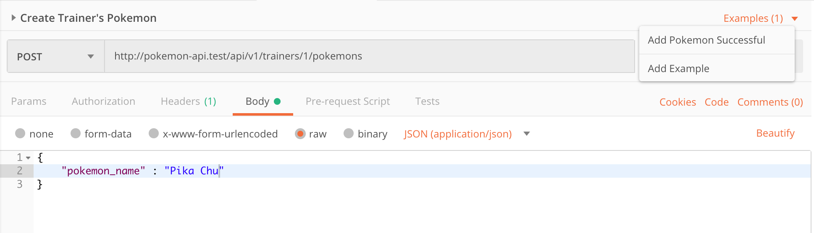

### Powered by [Postman Collection](https://www.getpostman.com/collection)


## Installation
```
composer require anl/postman-collection-generator
```

## About

You might want to document your api, but wait!... setting up postman collection
with your environment?
Sure that's great but for developers who are not fond of doing this manually,
Integrate **Postman Collection Generator** in your functional tests.
Code while making your api well documented.

## Postman Schema version
Package currently supports https://schema.getpostman.com/json/collection/v2.0.0/docs/index.html

## Easy Usage
### Include \PostmanGenerator\Traits\PostmanApiCallTrait in your test cases

#### Configure your collection.
```php
// Include to your test api call method.

...
$this->postmanApiCall(
    static::getCollectionGenerator(),
    static::getResponseParser(),
    'Create Trainer Successful', // Example name
    'Create Trainer', // Api call request name
    'Trainers', // Collection name
    'POST',
    'api/v1/trainers',
    ['trainer_name' => 'Ash Lee'],
    ['Authentication' => 'Bearer: AuthToken']
);
...

public function getCollectionGenerator(): CollectionGenerator
{
    $collection = new CollectionSchema([
         info' => new InfoSchema([
            'name' => 'Pokemon Api',
            'description' => 'Gotta catch them all. When you are a developer but loves pokemon.',
            'schema' => 'https://schema.getpostman.com/json/collection/v2.0.0/docs/index.html'
        ])
    ]);
    
    if($this->postmanGenerator === null){
        $this->postmanGenerator = new CollectionGenerator($collection, new Config());
    }
    
    return $this->postmanGenerator;
}

public function getResponseParser(): ResponseParserInterface
{
    return new ResponseParser($this->respose);
}

public function tearDownAfterClass()
{
    $this->postmanGenerator->generate();
}
```

### With Sub Folder
```php
$this->postmanApiCall(
    static::getCollectionGenerator(),
    static::getResponseParser(),
    'Add Pokemon Successful', // Example name
    'Create Trainer's Pokemon', // Api call request name
    'Trainers.Pokemons', // Collection name
    'POST',
    'api/v1/trainers/1/pokemons',
    ['pokemon_name' => 'Pika Chu'],
    ['Authentication' => 'Bearer: AuthToken']
);
```

### Output
#### Collection


#### Collection Request and Example Response




## Schema Structure
- CollectionSchema **PokemonApi**
    - CollectionItemSchema **PokemonTrainer**
        - CollectionSubItemSchema ```TrainerLaboratory```
            - ItemSchema ```Create Trainer Laboratory```
        - ItemSchema ```Create Trainer```
            - RequestSchema
            - ResponseSchema[]
                - [0] ```Create Trainer Successful```
                - [1] ```Create Trainer Not Found```
                
## Upcoming Releases
### v1.3.0
- This comes with the backwards-compatible manner of adding Lumen support 
for generating documentation.
### v1.4.0
- We aim to lessen the code when documenting, how about a feature to automatically suggest
the Example Name, Request Name and Sub-folders Name to your collection?
                
## Releases
### v1.2.2
- Added PostmanGenerator helper [PostmanApiCallTrait](https://github.com/AlbertLabarento/postman-collection-generator/blob/master/src/Traits/PostmanApiCallTrait.php)
### v1.2.1
- Resolved Issue #3
- Added caching mechanism for generated collection.
- Added Persistence mechanism thanks to [Nathan Page](https://github.com/natepage)
### v1.1.1
- Updated documentation.
### v1.0
- Be able to modify existing collection.
